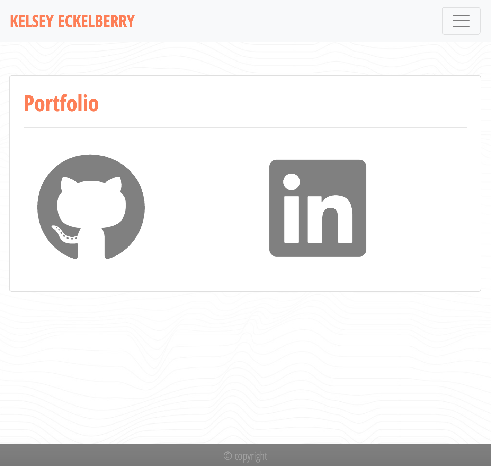
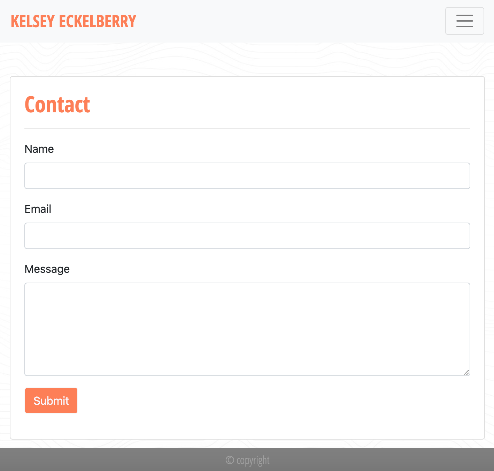

# Unit 02 Homework: Responsive Portfolio

## Description

I was tasked with creating a functional responsive portfolio using Bootstrap CSS Framework. This website contains:

   * An "About Me" page that displays a headshot and short bio.

   * A "Portfolio" page that has links to my Github and LinkedIn profiles.

   * A "Contact" Page that contains a contact form.

## Deployed Website

https://kelseyeckelberry.github.io/02_responsive_portfolio/

## Screenshots

.png)

